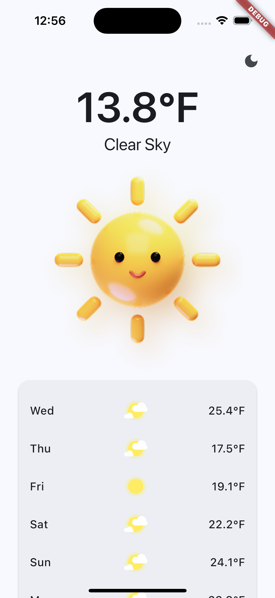
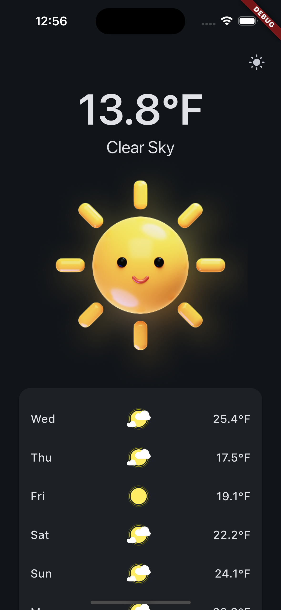
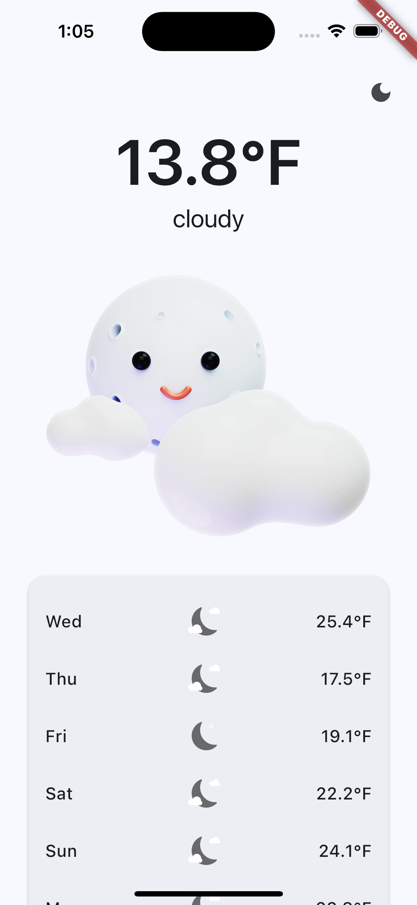
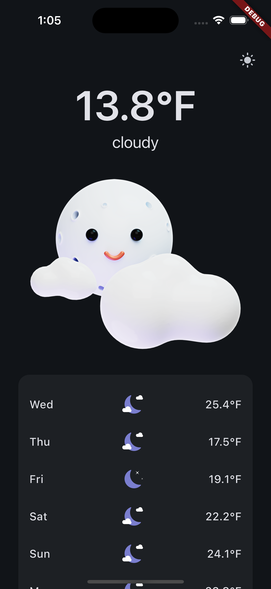

# 🌦️ Weather App

A **Flutter** weather application that dynamically displays weather conditions using **day/night images and icons**. The app adapts based on **weather descriptions, time of day, and theme mode**.

## Features

- **Dynamic Weather Images** – Displays different images for clear, cloudy, rainy, snowy, and windy conditions.  
- **Day/Night Mode** – Changes icons and backgrounds based on the time of day.  
- **Light/Dark Mode Support** – Icons and UI adapt to the app theme.  
- **7-Day Forecast** – Displays upcoming weather conditions with corresponding icons.  
- **Toggle Testing Mode** – Easily simulate different weather conditions using a switch.  
- **Live Weather Data** – Fetches real-time weather data using the [Open-Meteo API](https://open-meteo.com/en/docs#latitude=31.9401&longitude=-106.4252&current=temperature_2m,is_day,weather_code&minutely_15=&hourly=&daily=weather_code&temperature_unit=fahrenheit&wind_speed_unit=mph&precipitation_unit=inch&timezone=auto&models=).

---

## Screenshots

Here are examples of different weather scenarios in action:

| Clear Day (Light Mode) | Clear Day (Dark Mode)  |
|-------------|---------------|
|  |  |

| Cloudy Night (Light Mode) | Cloudy Night (Dark Mode) |
|-------------|---------------|
|  |  |

---

## Installation

1️⃣ **Clone the repository**
```sh
git clone https://github.com/your-username/weather-app.git
cd weather-app
```

2️⃣ **Install dependencies**
```sh
flutter pub get
```

3️⃣ **Run the app**
```sh
flutter run
```

---

## Credits

Built with ❤️ using **Flutter** & **MaterialUI**.

### 🎨 Design Credits
Special thanks to:
- **Mikołaj Niżnik** for the [Figma designs](https://www.figma.com/community/file/1023658389987124693).
- **Bora Dan** for the [Figma designs](https://www.figma.com/community/file/1028044423168519795).


